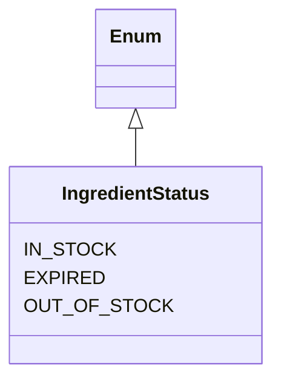
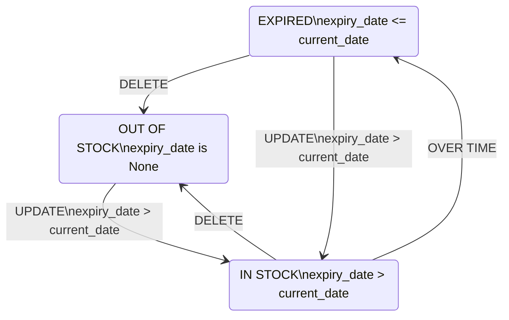

# Business Logic

## Ingredient.status is "Computed Field"



```python
class IngredientRead(IngredientBase):
    ...

    @root_validator
    def set_status(cls, values):
        if values["expiry_date"] is None:
            values["status"] = IngredientStatus.OUT_OF_STOCK
        elif values["expiry_date"] <= date.today():
            values["status"] = IngredientStatus.EXPIRED
        else:
            values["status"] = IngredientStatus.IN_STOCK

        return values
```

!!! note

    Pydantic v2 allows to define genuine computed fields.
    Pydantic v1 does not support computed fields and the recommended workaround is to use `root_validator` for this requirement.
    Pydantic v1 is used in this project because SQLModel does not support Pydantic v2 yet.

## Ingredient.status is "State Machine"


