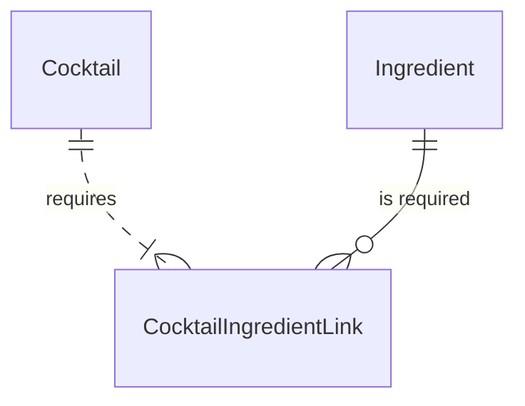
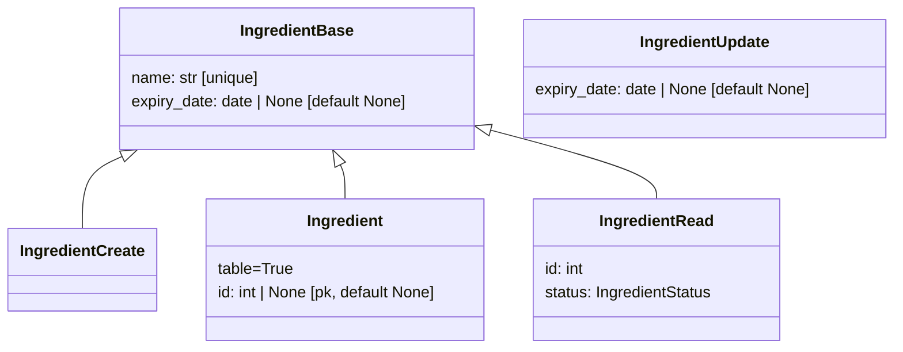
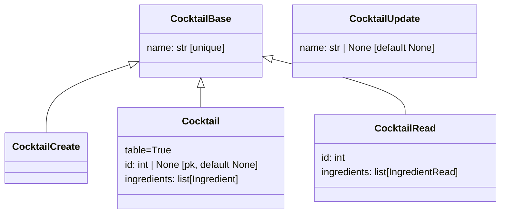
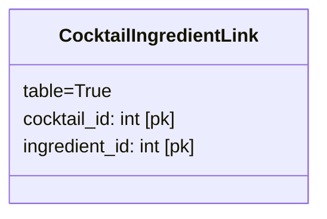

# Database

## Entity Relationship Diagram



## SQLModel / Pydantic Models

### Ingredient Models



!!! bug

    `IngredientUpdate` should not define `expiry_date` as default `None`!

    Such definition allows to send an empty UPDATE request and have `expiry_date` set to `None` which conveys the semantic of "set ingredient to out of stock".
    It would be better to force the user to explicitely set `expiry_date` to `None` if they want to set the ingredient to out of stock.

    Even better would be to force usage of the existing dedicated DELETE endpoint for setting an ingredient to out of stock.
    This would require to the UPDATE request to disallow empty requests or setting `expiry_date` to `None`.

### Cocktail Models



### CocktailIngredientLink Model



## Filter Available Cocktails

```python
def filter_available(statement: SelectOfScalar) -> SelectOfScalar:
    cte1 = (
        select(CocktailIngredientLink.cocktail_id, func.count().label("count"))
        .group_by(CocktailIngredientLink.cocktail_id)
        .cte("cocktail_ingredient_counts")
    )
    cte2 = (
        select(Ingredient.id.label("ingredient_id"))
        .where(Ingredient.expiry_date > date.today())
        .cte("available_ingredients")
    )
    cte3 = (
        select(
            CocktailIngredientLink.cocktail_id, func.count().label("available_count")
        )
        .join(cte2, CocktailIngredientLink.ingredient_id == cte2.c.ingredient_id)
        .group_by(CocktailIngredientLink.cocktail_id)
        .cte("cocktail_available_ingredient_counts")
    )

    return (
        statement.join(cte1, Cocktail.id == cte1.c.cocktail_id, isouter=True)
        .join(cte3, Cocktail.id == cte3.c.cocktail_id, isouter=True)
        .where(cte1.c.count == cte3.c.available_count)
    )
```
